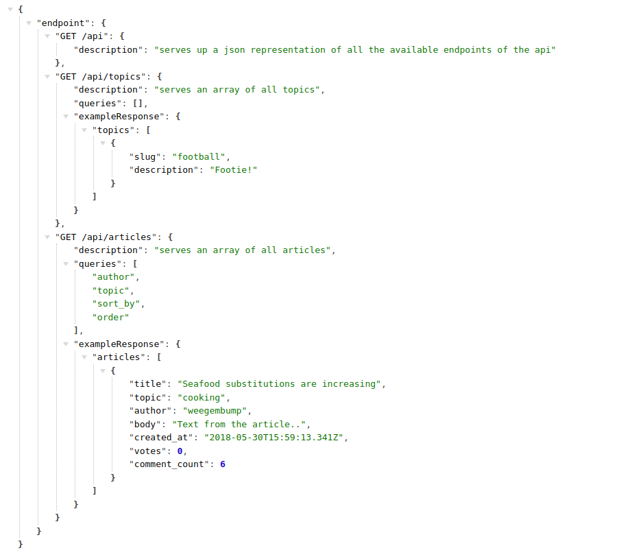

# Northcoders News API

## Table of Contents
1. [General Info](#general-info)
2. [Technologies](#technologies)
3. [Installation](#installation)
4. [Connection](#connection)
5. [Usage](#usage)
6. [Collaboration](#collaboration)

## General Info
NC News API is a well made project which will allow users to to write articles with different topics.
User can comment on articles and vote for their favourite ones.
You will be able populate the data based on users, topics, comments, articles.
***
### Link
**https://nc-news-9ihg.onrender.com/api**

### Screenshot


## Technologies
[NPM](https://docs.npmjs.com/cli/v10/commands/npm-install): Version 10.2.3

[PSQL](https://www.postgresql.org): Version 14.10

[dotenv](https://www.npmjs.com/package/dotenv): Version 16.3.1

[express](https://www.npmjs.com/package/express): Version 4.18.2

[express-json](https://www.npmjs.com/package/express-json): Version 1.0.0

[pg](https://www.npmjs.com/package/pg): Version 8.11.3

[pg-format](https://www.npmjs.com/package/node-pg-format): Version 1.0.4

[jest](https://jestjs.io/docs/getting-started): Version 27.5.1

[jest-extended](https://www.npmjs.com/package/jest-extended): Version 2.0.0

[jest-sorted](https://www.npmjs.com/package/jest-sorted): Version 1.0.14

[supertest](https://www.npmjs.com/package/supertest): Version 6.3.4
***

## Installation
### To Clone and install npm
***
```bash
git clone https://github.com/AmadReihun/be-nc-news.git
```
```bash
npm install
```
### To install dependencies
```bash
npm install dotenv --save
```
```bash
npm install express
```
```bash
npm install express-json
```
```bash
npm install node-pg-format
```
```bash
npm install --save-dev jest
```
```bash
npm install --save-dev jest-extended
```
```bash
npm install --save-dev jest-sorted
```
```bash
npm install supertest --save-dev
```

## Connection

You will need to add the below 2x files to your repo to be able to connect to the two databases locally.

### .env.development 
```bash
PGDATABASE=nc_news
```

### .env.test
```bash
PGDATABASE=nc_news_test
```


## Usage
### To connect to the database

```bash
psql
```
```bash
\c nc_news_test
```
### To run the database 
```bash
npm run setup-dbs
```
### To setup the dev database 
```bash
npm run seed
```
### To run test
```bash
npm run test
```
### To run the app
```bash
npm run start
```

## Collaboration
Pull requests are welcome. For major changes, please open an issue first
to discuss what you would like to change.

Please make sure to update tests as appropriate.

Please do not hesitate to reach me for any suggestion on question.


